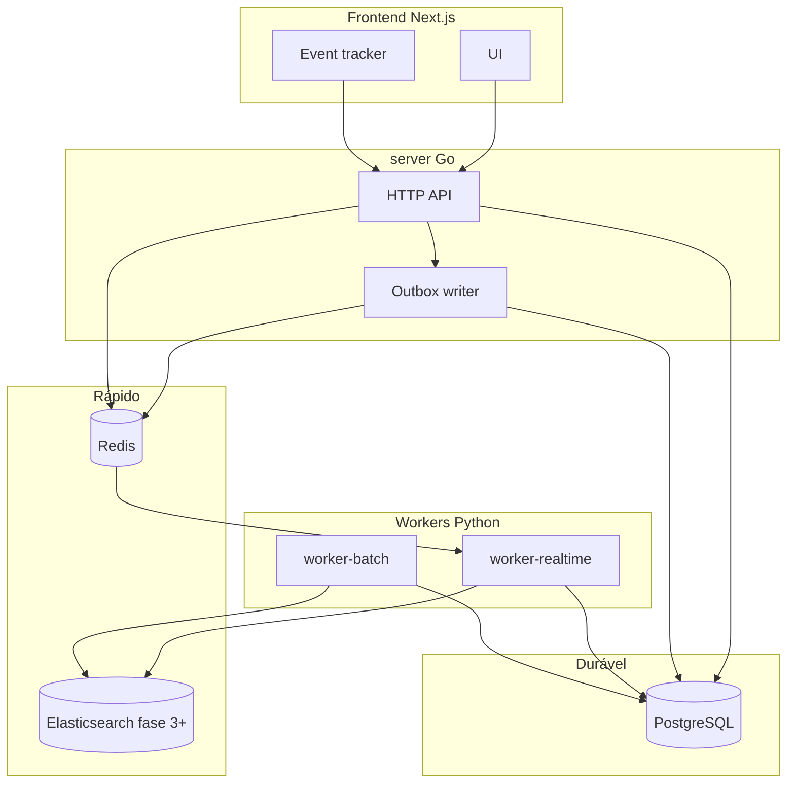

# Arquitetura

## Visão geral



## Camadas

| Camada | Responsabilidade |
|---|---|
| **API (Go)** | Auth, CRUD, feed, busca, servir scores pré-computados |
| **Postgres OLTP** | Usuários, grafo, posts, eventos, outbox |
| **Postgres analytics** | Agregados, scores, sugestões |
| **Redis** | Fila de jobs, cache de feed (fase 7) |
| **Elasticsearch** | Full-text em perfis e posts (fase 3+) |
| **Workers** | Indexação, graph, ML, churn, rollups |

## Durabilidade de eventos

Fluxo transacional na API:

```sql
BEGIN;
  INSERT INTO events (...);
  INSERT INTO outbox_jobs (job_type, payload, ...);
COMMIT;
```

O `worker-realtime` executa **outbox relay**:

1. Lê `outbox_jobs WHERE processed_at IS NULL`
2. Publica no Redis (`linkedin:jobs`)
3. Marca `processed_at`

Se Redis cair, jobs acumulam no outbox e são reprocessados. **Nenhum evento se perde.**

## Busca + recomendação

Sistemas separados que se encontram na UI:

| Fluxo | Recuperação | Ranking |
|---|---|---|
| Busca | Elasticsearch | Go re-ranqueia com affinity (top 50) |
| Sidebar "Pessoas sugeridas" | Postgres `user_connection_suggestions` | Pré-computado pelo worker batch |

## Deploy de workers

| Container | `WORKER_ROLE` | Jobs |
|---|---|---|
| `worker-realtime` | `realtime` | indexer, events-processor, notifications, outbox relay |
| `worker-batch` | `batch` | graph, recommendations, feed-ranking, churn, analytics-rollup, ml-training |
| `worker-all` | `all` | tudo (dev local) |

Mesma imagem Docker, papéis diferentes via env.

## Kafka (fase 7+)

Postgres continua fonte da verdade. Kafka entra **entre** outbox relay e consumers para replay e pipeline de dados — não substitui o outbox.

```
outbox → relay → Kafka topic → N consumers → warehouse / ML / ES
```
