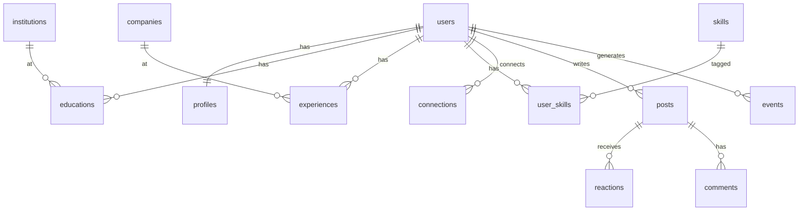

# Modelo de dados

## OLTP (operacional)

### Identidade

- **users** — credenciais (`email`, `password_hash`)
- **profiles** — dados públicos (`slug`, `headline`, `bio`, `location`, `birth_year`)

### Entidades normalizadas

- **institutions** — faculdades (`name`, `slug`)
- **companies** — empregadores (`name`, `slug`)
- **skills** — habilidades (`name`, `slug`)

Evita "UNIPe" vs "Universidade de Pernambuco" duplicados — essencial para affinity.

### Perfil profissional

- **educations** — `user_id`, `institution_id`, `field_of_study`, `start_year`, `end_year`
- **experiences** — `user_id`, `company_id`, `title`, `start_year`, `end_year`, `is_current`
- **user_skills** — N:N usuário ↔ skill

### Grafo social

- **connections** — `requester_id`, `addressee_id`, `status` (`pending`, `accepted`, `rejected`)
- Constraint: `requester_id < addressee_id` evita duplicata invertida

### Conteúdo

- **posts** — `author_id`, `body`, timestamps
- **reactions** — `post_id`, `user_id`, `kind` (default `like`)
- **comments** — `post_id`, `author_id`, `body`

### Eventos e outbox

- **events** — append-only: `user_id`, `event_type`, `payload JSONB`, `created_at`
- **outbox_jobs** — transactional outbox: `job_type`, `payload`, `processed_at`

## Analytics (scores pré-computados)

- **user_graph_metrics** — `pagerank`, `degree`, `community_id`
- **user_pair_affinity** — `viewer_id`, `target_id`, `score`, `reasons JSONB`
- **user_connection_suggestions** — top-K sugestões por viewer
- **user_feed_scores** — ranking de posts por usuário
- **user_churn_scores** — `churn_probability`, `risk_tier`
- **analytics.daily_active_users** — DAU por dia
- **analytics.post_engagement_daily** — engajamento agregado

## Índices Elasticsearch (fase 3)

### `people`

`user_id`, `slug`, `name`, `headline`, `bio`, `skills[]`, `schools[]`, `companies[]`, `location`

### `posts`

`post_id`, `author_id`, `author_name`, `body`, `created_at`, `reaction_count`

## Diagrama simplificado

