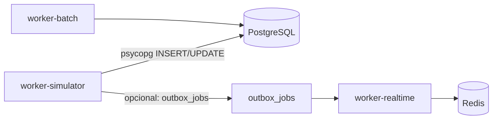

# Especificação — `worker-simulator`

Simulador de rede social sintética que **popula o sistema via psycopg** (sem HTTP). Foco: volume de dados, comportamento emergente e alimentação dos workers analytics/ML existentes.

**Relacionado:** [ROADMAP.md](ROADMAP.md) · [ARCHITECTURE.md](ARCHITECTURE.md) · [WORKERS.md](WORKERS.md)

---

## 1. Objetivos

| Objetivo | Descrição |
|----------|-----------|
| **Popular dados** | Milhares de usuários, posts, conexões, eventos |
| **Alimentar pipeline** | `events` → rollup → churn → A/B → ML training |
| **Comportamento realista** | Atributos + probabilidades, não regras rígidas de estereótipo |
| **Reprodutibilidade** | Seed RNG fixo; mesma config → mesma população inicial |
| **Performance** | Meta: ≥ 1.000 ações/minuto via INSERT direto |
| **Não testar HTTP** | Bypass da API; opcional smoke HTTP separado no e2e |

---

## 2. Posição na arquitetura



O simulador escreve nas **mesmas tabelas** que a API usaria. Workers downstream (indexer, graph, recommendations, churn, rollup, ml_training) **não precisam saber** que os dados são sintéticos.

### Modos de escrita

| Modo | O que faz | Quando usar |
|------|-----------|-------------|
| **Direto** | INSERT em `users`, `profiles`, `posts`, `connections`, `events`, etc. | Ações em massa, bootstrap |
| **Outbox** | INSERT em `outbox_jobs` para `search.index_profile`, `graph.recompute_user` | Quando quiser indexação ES assíncrona |
| **Eventos only** | Só `events` (ex.: `post_viewed`) | Simular navegação sem mutar OLTP |

**Default:** direto + batch de `events` + outbox esparso (a cada N perfis/posts).

---

## 3. Container e configuração

### Docker Compose

```yaml
# profile: sim — não sobe em produção
worker-simulator:
  profiles: ["sim"]
  build:
    context: ./worker
    dockerfile: Dockerfile
  environment:
    WORKER_ROLE: simulator
    DATABASE_URL: ...
    SIMULATOR_AGENT_COUNT: "2000"
    SIMULATOR_TICK_SEC: "1"
    SIMULATOR_SEED: "42"
    SIMULATOR_PHASE: "steady"   # bootstrap | steady
  depends_on:
    postgres:
      condition: service_healthy
```

### Variáveis de ambiente

| Variável | Default | Descrição |
|----------|---------|-----------|
| `WORKER_ROLE` | — | `simulator` (novo papel) |
| `DATABASE_URL` | — | Postgres |
| `SIMULATOR_AGENT_COUNT` | `2000` | Agentes ativos em steady state |
| `SIMULATOR_SEED` | `42` | Seed do RNG global |
| `SIMULATOR_TICK_SEC` | `1` | Intervalo entre ticks do loop principal |
| `SIMULATOR_PHASE` | `bootstrap` | `bootstrap` → cria população; `steady` → só interações |
| `SIMULATOR_BATCH_SIZE` | `50` | Ações por tick |
| `SIMULATOR_OUTBOX_EVERY` | `100` | Enfileira outbox a cada N escritas |
| `SIMULATOR_ENABLED` | `1` | Kill switch |

### Estrutura de código (proposta)

```
worker/linkedin_worker/
├── simulator/
│   ├── __init__.py
│   ├── main.py              # loop 24/7
│   ├── bootstrap.py         # fase 1: criar N agentes
│   ├── agent.py             # dataclass Agent + estado Markov
│   ├── archetypes.py        # distribuições por arquétipo
│   ├── demographics.py      # idade, gênero, cidade, lat/lon
│   ├── scoring.py           # P(seguir), P(aceitar), P(curtir)
│   ├── actions/
│   │   ├── connections.py
│   │   ├── posts.py
│   │   ├── reactions.py
│   │   ├── comments.py
│   │   └── events.py
│   ├── content/
│   │   ├── templates.py     # textos por tópico/arquétipo
│   │   └── llm.py           # fase longa — opcional
│   └── db.py                # helpers psycopg (transações, bulk)
```

---

## 4. Modelo de agente

### 4.1 Atributos (persistidos)

Nova migration `000005_simulator.sql`:

```sql
CREATE TABLE IF NOT EXISTS simulator_agents (
    user_id         UUID PRIMARY KEY REFERENCES users(id) ON DELETE CASCADE,
    archetype       TEXT NOT NULL,
    age             INT NOT NULL,
    gender          TEXT NOT NULL,
    city            TEXT NOT NULL,
    latitude        DOUBLE PRECISION,
    longitude       DOUBLE PRECISION,
    extraversion    DOUBLE PRECISION NOT NULL DEFAULT 0.5,
    activity_level  DOUBLE PRECISION NOT NULL DEFAULT 0.5,
    interests       JSONB NOT NULL DEFAULT '[]',
    markov_state    TEXT NOT NULL DEFAULT 'offline',
    rng_offset      INT NOT NULL DEFAULT 0,
    created_at      TIMESTAMPTZ NOT NULL DEFAULT now()
);

CREATE INDEX IF NOT EXISTS idx_simulator_agents_archetype ON simulator_agents(archetype);
CREATE INDEX IF NOT EXISTS idx_simulator_agents_city ON simulator_agents(city);
```

`users` + `profiles` continuam sendo a identidade “oficial” do sistema; `simulator_agents` guarda metadados de simulação.

### 4.2 Arquétipos (Nível 1)

| Arquétipo | Interesses típicos | Janela ativa (hora local) | activity_level μ |
|-----------|-------------------|---------------------------|------------------|
| `programmer` | go, python, devops | 20–02 | 0.6 |
| `fitness` | saúde, treino, nutrição | 06–09 | 0.7 |
| `student` | estudos, estágio | 14–23 | 0.8 |
| `entrepreneur` | negócios, startups | 08–18 | 0.5 |
| `recruiter` | vagas, rh, carreira | 09–17 | 0.4 |
| `designer` | ux, figma, design | 10–19 | 0.55 |
| `data_scientist` | estatística, ml, python | 09–22 | 0.65 |

Cada agente sorteia arquétipo + ruído nos atributos contínuos (`extraversion`, `activity_level`).

### 4.3 Demografia (Nível 2+)

Cidades iniciais (com lat/lon):

- Recife, Olinda, São Paulo, Rio de Janeiro, Belo Horizonte, João Pessoa

Distribuição de idade: mistura de normais truncadas por faixa etária (18–65).

Gênero: categorias `M`, `F`, `other` com proporções configuráveis.

**Importante:** comportamentos sociais emergem de **scores**, não de `if gender == F`.

---

## 5. Modelo de atração social

Score de afinidade entre viewer `A` e target `B`:

```
score(A,B) =
    w1 * jaccard(interests_A, interests_B)
  + w2 * mutual_connections(A,B) / max(1, degree(A))
  + w3 * geo_score(distance_km(A,B))      # gaussiana
  + w4 * age_score(|age_A - age_B|)       # decai com diferença
  + w5 * log(1 + popularity(B))           # efeito Matthew
```

Pesos iniciais (calibráveis):

| Feature | Peso |
|---------|------|
| Interesses | 0.30 |
| Amigos em comum | 0.25 |
| Proximidade geo | 0.20 |
| Proximidade etária | 0.15 |
| Popularidade | 0.10 |

Ações derivadas:

```
P(seguir A→B)   = sigmoid(α * score - β)
P(aceitar B→A)  = sigmoid(γ * score + δ * extraversion_B)
P(curtir post)  = sigmoid(η * topic_match(agent, post) + θ * activity)
P(comentar)     = P(curtir) * κ * extraversion
```

Homofilia e preferências etárias/geográficas **emergem** naturalmente se `w3`, `w4` forem calibrados — sem codificar estereótipos como regras absolutas.

---

## 6. Máquina de estados (Markov — Nível 2)

Estados por agente:

```text
offline ──P1──> browsing ──P2──> reading ──P3──> liking
                  │                │              │
                  │                └──P4──> commenting
                  │
                  └──P5──> posting
                  │
                  └──P6──> connecting
```

Matriz de transição **depende do arquétipo e hora do dia**:

- `programmer` às 22h: `offline → browsing` com P alta
- `fitness` às 7h: `offline → posting` com P moderada
- `recruiter` às 12h: `browsing → connecting` com P alta

A cada tick, para cada agente “despertável”:

1. Se `offline` e hora ∈ janela ativa → transição para `browsing`
2. Senão, amostra próximo estado
3. Executa ação correspondente via psycopg
4. Volta a `offline` ou `browsing` com P de sessão curta

---

## 7. Ações no banco (psycopg)

### 7.1 Bootstrap (fase `bootstrap`)

Para `i` em `1..SIMULATOR_AGENT_COUNT`:

1. `INSERT users` (email `sim-{uuid}@sim.local`, bcrypt hash fixo)
2. `INSERT profiles` (nome, slug, headline, location, birth_year)
3. `INSERT simulator_agents` (metadados)
4. `INSERT educations` / `experiences` / `user_skills` (amostra por arquétipo)
5. `INSERT outbox_jobs` (`search.index_profile`) — opcional

Commit a cada 100 agentes.

### 7.2 Steady state (fase `steady`)

Por tick, amostra `SIMULATOR_BATCH_SIZE` agentes e executa:

| Ação | Tabelas | Evento |
|------|---------|--------|
| Criar post | `posts` | `post_created` |
| Curtir | `reactions` | `post_liked` |
| Comentar | `comments` | `comment_created` |
| Pedir conexão | `connections` (pending) | `connection_requested` |
| Aceitar conexão | `connections` (accepted) | `connection_accepted` |
| Ver post | — | `post_viewed` |
| Login simulado | — | `session_start` |

Todas as ações mutáveis também inserem em `events` (payload JSON com ids).

### 7.3 Senha e autenticação

Agentes simulados **não precisam de login HTTP**. Campo `password_hash` pode usar hash bcrypt de senha fixa interna (`simulator-internal`) para consistência de schema.

### 7.4 Integridade

- Conexões: respeitar `requester_id <> addressee_id` e índice único de par (migration 003)
- Reações: `ON CONFLICT DO NOTHING` (um like por par post/user)
- Posts: corpo mínimo 1 char; templates variados

---

## 8. Conteúdo de posts e comentários

### Nível 1 — Templates

Arquivo `content/templates.py` com listas por tópico:

```python
TEMPLATES = {
    "tech": [
        "Migrando mais um serviço para Go. Latência caiu 40%.",
        "Alguém mais usando Redis como fila além de cache?",
    ],
    "fitness": [
        "Treino de pernas feito. PR no agachamento!",
        "Dica: hidratação antes das 10h faz diferença.",
    ],
    ...
}
```

Seleção: `topic ~ interests` do autor + ruído.

### Nível longo — LLM (opcional)

- Flag `SIMULATOR_LLM=1` + `OPENAI_API_KEY`
- Rate limit: max N gerações/minuto
- Fallback para templates se API falhar

---

## 9. Loop principal (24/7)

```python
def run_simulator():
  conn = connect()
  if phase == "bootstrap":
      bootstrap(conn, agent_count)
  agents = load_agents(conn)
  while True:
      tick_start = now()
      batch = sample_agents(agents, batch_size)
      for agent in batch:
          if not is_active_hour(agent):
              continue
          state = transition(agent)  # Markov
          execute_action(conn, agent, state)
      conn.commit()
      sleep(max(0, tick_sec - elapsed))
```

Graceful shutdown: SIGTERM → commit pendente → exit.

---

## 10. Interação com workers existentes

| Worker | Gatilho após simulação |
|--------|------------------------|
| `outbox_relay` + `indexer` | Outbox `search.index_*` |
| `graph` | Cron 6h — PageRank em grafo grande |
| `recommendations` | Cron 6h — affinity em escala |
| `feed_ranking` | Cron 1h |
| `churn` | Cron diário — idle patterns |
| `analytics_rollup` | Cron — DAU, coortes, A/B |
| `ml_training` | Semanal — labels de conexão abundantes |

**Não é necessário** chamar workers manualmente; crons absorvem carga. Para dev: reduzir intervalos de cron ou endpoint interno `run-batch` (roadmap M7).

---

## 11. Fases de implementação

### Fase S0 — Scaffold (1–2 dias)

- [ ] `WORKER_ROLE=simulator` em `main.py`
- [ ] `simulator/main.py` loop vazio + log
- [ ] Profile `sim` no docker-compose
- [ ] Migration `000005_simulator.sql`

### Fase S1 — Bootstrap (2–3 dias)

- [ ] Criar 500 agentes com perfil completo
- [ ] Templates de posts
- [ ] Inserir eventos `session_start`, `post_created`
- [ ] Teste: `SELECT COUNT(*) FROM users` ≥ 500

### Fase S2 — Interações básicas (3–4 dias)

- [ ] Like, comment, post em steady state
- [ ] Score de afinidade simplificado (interesses + geo)
- [ ] Connection request/accept
- [ ] Meta: 10k eventos/hora

### Fase S3 — Markov + arquétipos (1 semana)

- [ ] Máquina de estados por agente
- [ ] Janelas de atividade por arquétipo
- [ ] 2.000 agentes steady state

### Fase S4 — Escala e validação (2 semanas)

- [ ] 5k–10k agentes
- [ ] Notebook validação (power law, homofilia)
- [ ] Métricas: eventos/min, tamanho do grafo, modularidade

---

## 12. Testes

| Tipo | O que valida |
|------|--------------|
| **Unit** | `scoring.py`, transições Markov, templates |
| **Integration** | bootstrap 10 agentes em Postgres de teste; contagens |
| **Smoke** | `SIMULATOR_AGENT_COUNT=50` por 60s; workers não quebram |

```bash
# Exemplo futuro
cd worker && pytest tests/test_simulator_scoring.py -q
SIMULATOR_AGENT_COUNT=20 python -m linkedin_worker.main  # WORKER_ROLE=simulator
```

---

## 13. Observabilidade

- Logs estruturados: `actions_per_tick`, `agent_count`, `phase`
- Métricas Prometheus (fase S4): `simulator_actions_total{type=...}`
- Não expor endpoint HTTP no simulador

---

## 14. Riscos e mitigação

| Risco | Mitigação |
|-------|-----------|
| Postgres lento com 50k agentes | Batch inserts, índices, `COPY` para bootstrap |
| Disco cheio (`events`) | Retention policy ou particionamento por mês |
| ES indexing atrasado | Outbox throttling; profile `sim` sem ES no início |
| Comportamento não realista | Calibrar pesos com notebook; comparar com literatura |
| Estereótipos rígidos | **Sempre** usar scores contínuos; documentar no TCC |

---

## 15. Critérios de aceite (MVP simulador)

1. `docker compose --profile sim up` sobe `worker-simulator`
2. Em 30 min, ≥ 2.000 usuários em `users` (bootstrap)
3. Em 24h steady, ≥ 100.000 eventos em `events`
4. `/analytics/overview` mostra DAU > 0 e MAU coerente
5. `user_graph_metrics` populado após cron graph
6. `ab_experiment_results` com amostra por variante
7. Seed `SIMULATOR_SEED=42` reproduz mesma contagem de agentes

---

## 16. Próximo passo imediato

Implementar **Fase S0 + S1** conforme [ROADMAP.md](ROADMAP.md) item M1.

Ordem de commits sugerida:

1. `migration: add simulator_agents table`
2. `feat(simulator): scaffold WORKER_ROLE=simulator`
3. `feat(simulator): bootstrap 500 agents via psycopg`
4. `feat(simulator): steady-state posts and events`
5. `docker: add worker-simulator profile sim`
